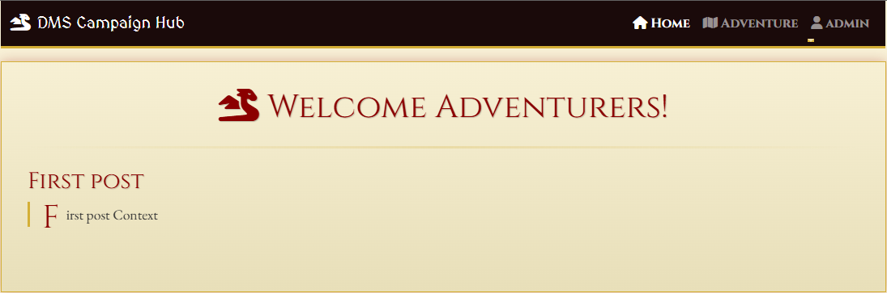
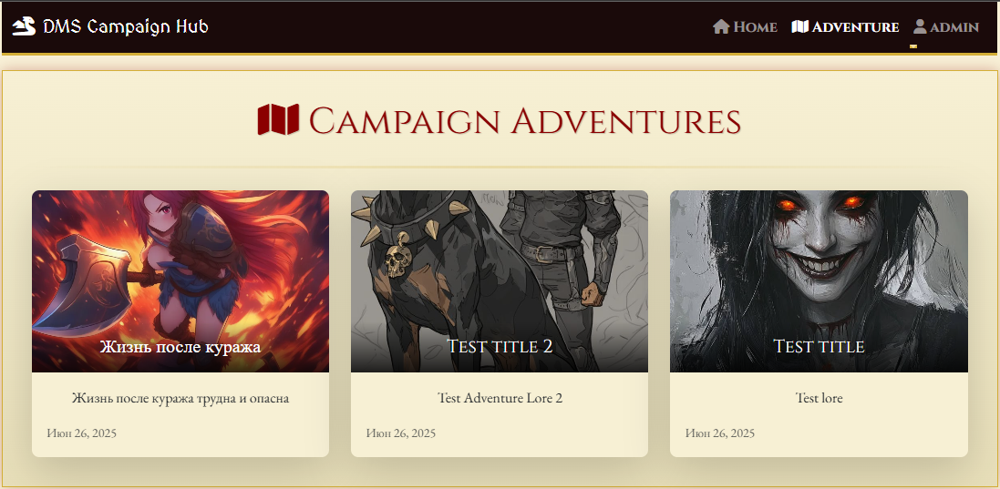
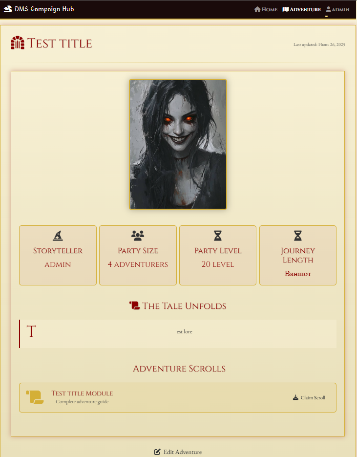
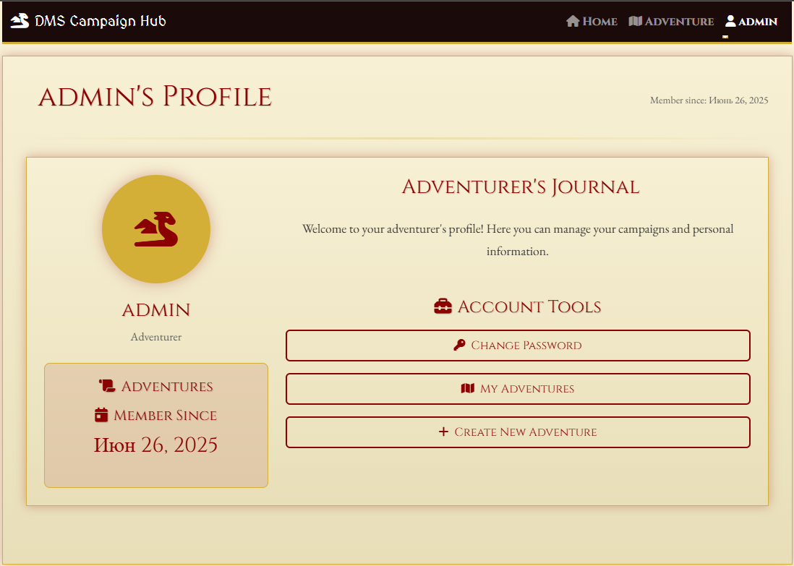

# Dungeon Master's Hub - D&D 5e Campaign Manager



**Dungeon Master's Hub** - это специализированная платформа для публикации и скачивания готовых приключений для Dungeons & Dragons 5th Edition. Сайт предлагает удобный интерфейс для авторов и игроков с возможностью:

- 📤 Загружать готовые модули приключений
- 📥 Скачивать приключения в удобном формате
- 🔍 Просматривать каталог доступных материалов

Платформа создана для удобного обмена готовыми приключениями между участниками D&D-сообщества.

## Технологии

- **Бэкенд**: Django 5
- **Фронтенд**: Bootstrap 5, HTML5, CSS3 (с анимациями)
- **JavaScript**: jQuery для интерактивных элементов
- **Иконки**: Font Awesome 6
- **Дополнительно**: Django Forms, Django ORM, SQLite

## Установка и запуск

1. Клонируйте репозиторий:
```bash
git clone https://github.com/cursed-amari/dnd_adventure_site.git
cd dnd_adventure_site
```

2. Создайте и активируйте виртуальное окружение:
```bash
python -m venv .venv
source .venv/bin/activate  # Linux/MacOS
.venv\Scripts\activate    # Windows
```

3. Установите зависимости:
```bash
pip install -r requirements.txt
```

4. Создайте файл .env в каталоге adventure_site:
```bash
KEY = ваш_ключ
```

5. Примените миграции:
```bash
python manage.py migrate
```

6. Создайте суперпользователя:
```bash
python manage.py createsuperuser
```

7. Запустите сервер:
```bash
python manage.py runserver
```

8. Откройте в браузере: [http://127.0.0.1:8000](http://127.0.0.1:8000)

## Структура проекта

```
django_dnd_site/
├── .venv/                     # Виртуальное окружение
├── adventure/                 # Основное приложение
│   ├── adventure/             # Модуль приключений
│   ├── 2025/                  # Годовой раздел приключений
│   ├── default/               # Настройки по умолчанию
│   ├── migrations/            # Миграции базы данных
│   ├── templates/             # Шаблоны приложения
│   ├── __init__.py
│   ├── admin.py               # Административная конфигурация
│   ├── apps.py                # Конфигурация приложения
│   ├── forms.py               # Формы Django
│   ├── models.py              # Модели данных
│   ├── tests.py               # Тесты
│   ├── urls.py                # URL-маршруты приложения
│   ├── utils.py               # Вспомогательные утилиты
│   └── views.py               # Контроллеры
├── adventure_site/            # Конфигурация проекта
│   ├── .env                   # Файл переменных окружения
│   ├── __init__.py
│   ├── asgi.py                # ASGI-конфигурация
│   ├── settings.py            # Настройки проекта
│   ├── urls.py                # Главные URL-маршруты
│   └── wsgi.py                # WSGI-конфигурация
├── home_page/                 # Приложение домашней страницы
│   ├── migrations/            # Миграции
│   ├── templates/             # Шаблоны
│   ├── __init__.py
│   ├── admin.py
│   ├── apps.py
│   ├── models.py
│   ├── tests.py
│   ├── urls.py
│   └── views.py
├── users/                     # Приложение пользователей
│   ├── migrations/
│   ├── templates/
│   ├── __init__.py
│   ├── admin.py
│   ├── apps.py
│   ├── forms.py               # Формы для пользователей
│   ├── models.py
│   ├── tests.py
│   ├── urls.py
│   └── views.py
├── db.sqlite3                 # База данных SQLite
├── LICENSE                    # Лицензия MIT
├── manage.py                  # Скрипт управления Django
└── README.md                  # Документация
```

## Использование JavaScript

Проект использует JavaScript (с jQuery) для следующих функций:

1. **Переключение видимости пароля**:
```javascript
$('.password-toggle').click(function() {
    const input = $(this).prev('input');
    const type = input.attr('type') === 'password' ? 'text' : 'password';
    input.attr('type', type);
    $(this).toggleClass('fa-eye fa-eye-slash');
});
```

2. **Предпросмотр загружаемых изображений**:
```javascript
$('input[type="file"]').change(function(e) {
    const preview = $(this).siblings('.file-upload-preview');
    const fileName = e.target.files[0].name;
    
    if (this.id === 'id_image') {
        const reader = new FileReader();
        reader.onload = function(e) {
            preview.html(``);
        }
        reader.readAsDataURL(e.target.files[0]);
    }
});
```

3. **Анимации при загрузке страницы**:
```javascript
$(document).ready(function() {
    $('.fade-in').each(function(i) {
        $(this).delay(200 * i).queue(function() {
            $(this).addClass('fade-in').dequeue();
        });
    });
});
```

4. **Интерактивные элементы интерфейса**:
   - Анимации карточек при наведении
   - Плавные переходы между состояниями
   - Динамическое обновление элементов без перезагрузки страницы

## Скриншоты

### Главная страница


### Каталог приключений


### Детали приключения


### Создание приключения


### Профиль пользователя


## Особенности дизайна

- **Тематическое оформление**: Пергаментный фон, средневековые шрифты, иконки в стиле D&D
- **Анимации**: Плавные переходы, эффекты при наведении, анимация загрузки элементов
- **Адаптивность**: Полная поддержка мобильных устройств и планшетов
- **Интерактивные элементы**: Кастомные формы, карточки приключений, интерактивные кнопки

## Лицензия

Этот проект распространяется под лицензией GNU GENERAL PUBLIC LICENSE Version 3. Подробнее см. в файле [LICENSE](LICENSE).

---

**Создавайте эпические приключения, собирайте свою партию и отправляйтесь в незабываемые путешествия с Dungeon Master's Hub!**